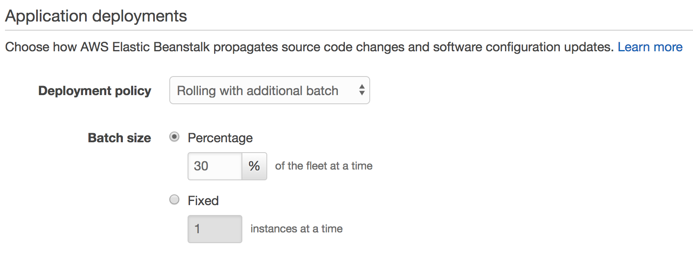
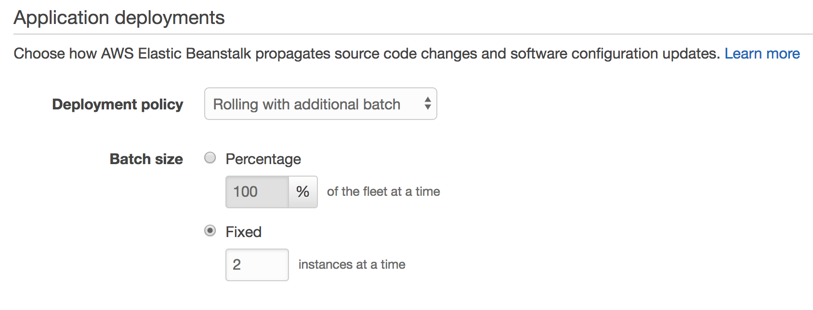

## Deployment with Elastic Beanstalk Command (EB) Line Interface (CLI)

### 1. Setup EB CLI

#### 1.1 Install EB CLI

1.  Run this command to install EB CLI

```
$ pip install awsebcli --upgrade --user
```

2.  Verify EB CLI is installed

```
$ eb --version

EB CLI 3.14.3 (Python 2.7.1)
```

#### 1.2 Configure EB CLI

1.  Initialise your Git repository

```
$ git init

Initialized empty Git repository in /home/ec2-user/environment/beanstalk-workshop/.git/
```

As a best practice for Node, we should not commit our dependencies to our repository

2.  Run the command to tell git to ignore the **node_modules** folder

```
$ echo "node_modules" >> .gitignore
```

3.  Add and commit the application code

```
$ git add .

$ git commit -m "first commit"
```

EB CLI will now recognize that your application is set up with Git.

4.  Initialise EB application

```
$ eb init
```

5.  Enter **7** to select Singapore region

```
Select a default region
1) us-east-1 : US East (N. Virginia)
2) us-west-1 : US West (N. California)
3) us-west-2 : US West (Oregon)
4) eu-west-1 : EU (Ireland)
5) eu-central-1 : EU (Frankfurt)
6) ap-south-1 : Asia Pacific (Mumbai)
7) ap-southeast-1 : Asia Pacific (Singapore)
8) ap-southeast-2 : Asia Pacific (Sydney)
9) ap-northeast-1 : Asia Pacific (Tokyo)
10) ap-northeast-2 : Asia Pacific (Seoul)
11) sa-east-1 : South America (Sao Paulo)
12) cn-north-1 : China (Beijing)
13) cn-northwest-1 : China (Ningxia)
14) us-east-2 : US East (Ohio)
15) ca-central-1 : Canada (Central)
16) eu-west-2 : EU (London)
17) eu-west-3 : EU (Paris)
(default is 3): 7
```

6.  Enter **beanstalk-workshop** as application name

```
Enter Application Name
(default is "beanstalk-workshop"): beanstalk-workshop
```

7.  Enter **Y** to select Node.js platform

```
It appears you are using Node.js. Is this correct?
(Y/n): Y
```

8.  Enter **y** to continue with CodeCommit with Elastic Beanstalk

```
WARNING: Git is in a detached head state. Using branch "default".
Note: Elastic Beanstalk now supports AWS CodeCommit; a fully-managed source control service. To learn more, see Docs: https://aws.amazon.com/codecommit/
Do you wish to continue with CodeCommit? (y/N) (default is n): y
```

9.  Enter **1** to create a new CodeCommit repository

```
Select a repository
1) [ Create new Repository ]
(default is 1): 1
```

Enter a name for your repository, I've chosen **"beanstalk-workshop"** in the following example

```
Enter Repository Name
(default is "origin"):  beanstalk-workshop
```

Enter a name for your branch, I've chosen **"master"** in the following example

```
Enter Branch Name
***** Must have at least one commit to create a new branch with CodeCommit *****
(default is "master"): master
```

10. Enter **n** when prompted to setup SSH access

```
Cannot setup CodeCommit because there is no Source Control setup, continuing with initialization
Do you want to set up SSH for your instances?
(Y/n): n
```

### 3. Deploy application with EB CLI

#### 3.1 Create EB environment

1.  Run eb create command to create an EB environment. This creates an environment and deploys your application

```
$ eb create sample-node-env1 --elb-type application
```

#### 3.2 View deployed application

1.  Navigate to the EB service, and select your newly created environment **sample-node-env1**


2.  Access your application via the URL shown


You'll be greeted with the hello world message


### 4. Updating an application with EB CLI

1.  Edit **index.js** file and change our API response string from

```
app.get("/", (req, res) => {
  res.send("Hello world from a Node.js app2!");
});
```

to

```
app.get("/", (req, res) => {
  res.send("Server is up on: " + process.env.PORT);
});
```

2.  Commit the changes to git. As you've configured CodeCommit as your repository during **eb init**, only committed changes to your repository will be deployed

```
$ git add .
$ git commit -m "v2.0"
$ git push
```

3.  Deploy your updated application

```
$ eb deploy
```

4.  Now refresh your browser to view the updated API response


### 5. Configuring Elastic Beanstalk Environments with ebextensions

You can add AWS Elastic Beanstalk configuration files (.ebextensions) to your web application's source code to configure your environment and customize the AWS resources that it contains.

Reference: https://docs.aws.amazon.com/elasticbeanstalk/latest/dg/ebextensions.html

#### 5.1 Configuring Auto Scaling groups

1.  Create a new folder **.ebextensions**. ebextensions are used to customise our Elastic Beanstalk environments.

```
$ mkdir ~/environment/beanstalk-workshop/.ebextensions
```

2.  Create our configuration file **asg.config** in the ebextensions folder and edit it with the IDE

```
$ touch ~/environment/beanstalk-workshop/.ebextensions/asg.config
```

Add the following configuration:

```
option_settings:
  aws:autoscaling:asg:
    Availability Zones: Any
    Cooldown: '720'
    MaxSize: '4'
    MinSize: '2'
```

This updates the application to maintain at least 2 EC2 instances across

#### 5.2 Changing Deployment Policy

By default, your environment uses rolling deployments if you created it with the console or EB CLI, or all-at-once deployments if you created it with a different client (API, SDK, or AWS CLI).

With rolling deployments, Elastic Beanstalk splits the environment's EC2 instances into batches and deploys the new version of the application to one batch at a time, leaving the rest of the instances in the environment running the old version of the application. During a rolling deployment, some instances serve requests with the old version of the application, while instances in completed batches serve other requests with the new version.

If you need to maintain full capacity during deployments, you can configure your environment to launch a new batch of instances prior to taking any instances out of service. This option is called a rolling deployment with an additional batch. When the deployment completes, Elastic Beanstalk terminates the additional batch of instances.

Let's change the deployment policy Rolling deployment with an **additional batch**.

1.  Similar to before, create our configuration file **RollBatch.config** in the ebextensions folder, and edit it with the IDE

```
$ touch ~/environment/beanstalk-workshop/.ebextensions/RollBatch.config
```

Add the following configuration to the newly created file

```
option_settings:
  aws:elasticbeanstalk:command:
    DeploymentPolicy: RollingWithAdditionalBatch
    BatchSizeType: Fixed
    BatchSize: 2
  aws:autoscaling:updatepolicy:rollingupdate:
    RollingUpdateEnabled: true
    MaxBatchSize: 2
    MinInstancesInService: 2
    RollingUpdateType: Health
    Timeout: PT45M
```

2.  Deploy changes

```
$ eb deploy
```

3.  In the AWS console, navigate to Elastic Beanstalk -> sample-node-env1 -> Configuration -> Rolling updates and deployments.



Note that batch size is set at **30%** rather than the fixed batch size of **2**. This is due to EB CLI defaulting to recommended values.

The Elastic Beanstalk Command Line Interface (EB CLI) and Elastic Beanstalk console provide recommended values for some configuration options. These values can be different from the default values and are set at the API level when your environment is created. Recommended values allow Elastic Beanstalk to improve the default environment configuration without making backwards incompatible changes to the API.

Reference: https://docs.aws.amazon.com/elasticbeanstalk/latest/dg/command-options.html#configuration-options-recommendedvalues

4.  We will override the recommended value with **eb config** command

```
$ eb config
```

Use **ctrl-W** to search for "aws:elasticbeanstalk:command", and remove the "BatchSize" & "BatchSizeType" lines.

Before:

```
aws:elasticbeanstalk:command:
  BatchSize: '30'
  BatchSizeType: Percentage
  DeploymentPolicy: RollingWithAdditionalBatch
  IgnoreHealthCheck: 'false'
  Timeout: '600'
```

After:

```
aws:elasticbeanstalk:command:
  DeploymentPolicy: RollingWithAdditionalBatch
  IgnoreHealthCheck: 'false'
  Timeout: '600'
```

5.  Validate the configuration shown in the console is now taken from the ebextension file **RollBatch.config** deployed earlier:



6.  Now let's updated our application and redeploy it. Edit **index.js** file and change our API response string from

```
app.get("/", (req, res) => {
  res.send("Server is up on: " + process.env.PORT);
});
```

to

```
app.get("/", (req, res) => {
  res.send("Immutable deployments are awesome. Server is up on: " + process.env.PORT);
});
```

We're done, continue to [Lab 3 : Create & Deploy Your First Docker Image](./doc-module-03.md)

```

```
