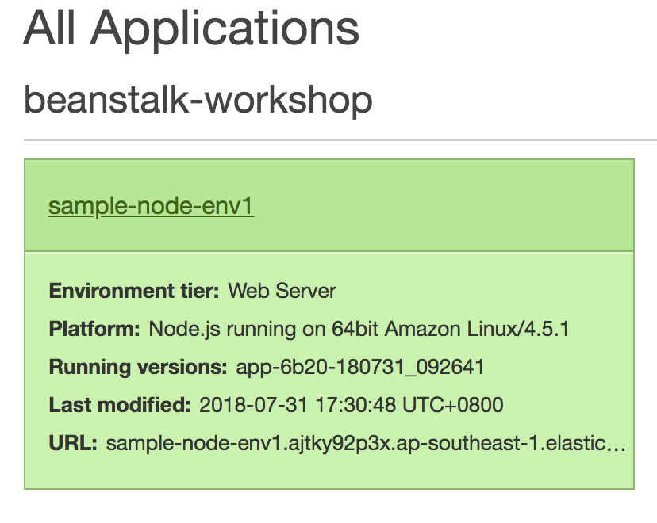
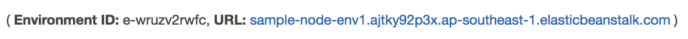
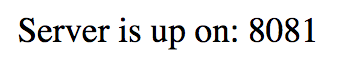

## Deployment with Elastic Beanstalk Command (EB) Line Interface (CLI)

### 1. Setup EB CLI

#### 1.1 Install EB CLI

1.  Run this command to install EB CLI

```
$ pip install awsebcli --upgrade --user
```

2.  Verify EB CLI is installed

```
$ eb --version

EB CLI 3.14.3 (Python 2.7.1)
```

#### 1.2 Configure EB CLI

1.  Initialise your Git repository

```
$ git init

Initialized empty Git repository in /home/ec2-user/environment/beanstalk-workshop/.git/
```

As a best practice for Node, we should not commit our dependencies to our repository

2.  Run the command to tell git to ignore the **node_modules** folder

```
$ echo "node_modules" >> .gitignore
```

3.  Add and commit the application code

```
$ git add .

$ git commit -m "first commit"
```

EB CLI will now recognize that your application is set up with Git.

4.  Initialise EB application

```
$ eb init
```

5.  Enter **7** to select Singapore region

```
Select a default region
1) us-east-1 : US East (N. Virginia)
2) us-west-1 : US West (N. California)
3) us-west-2 : US West (Oregon)
4) eu-west-1 : EU (Ireland)
5) eu-central-1 : EU (Frankfurt)
6) ap-south-1 : Asia Pacific (Mumbai)
7) ap-southeast-1 : Asia Pacific (Singapore)
8) ap-southeast-2 : Asia Pacific (Sydney)
9) ap-northeast-1 : Asia Pacific (Tokyo)
10) ap-northeast-2 : Asia Pacific (Seoul)
11) sa-east-1 : South America (Sao Paulo)
12) cn-north-1 : China (Beijing)
13) cn-northwest-1 : China (Ningxia)
14) us-east-2 : US East (Ohio)
15) ca-central-1 : Canada (Central)
16) eu-west-2 : EU (London)
17) eu-west-3 : EU (Paris)
(default is 3): 7
```

6.  Enter **beanstalk-workshop** as application name

```
Enter Application Name
(default is "beanstalk-workshop"): beanstalk-workshop
```

7.  Enter **Y** to select Node.js platform

```
It appears you are using Node.js. Is this correct?
(Y/n): Y
```

8.  Enter **y** to continue with CodeCommit with Elastic Beanstalk

```
WARNING: Git is in a detached head state. Using branch "default".
Note: Elastic Beanstalk now supports AWS CodeCommit; a fully-managed source control service. To learn more, see Docs: https://aws.amazon.com/codecommit/
Do you wish to continue with CodeCommit? (y/N) (default is n): y
```

9.  Enter **1** to create a new CodeCommit repository

```
Select a repository
1) [ Create new Repository ]
(default is 1): 1
```

Enter a name for your repository, I've chosen **"beanstalk-workshop"** in the following example

```
Enter Repository Name
(default is "origin"):  beanstalk-workshop
```

Enter a name for your branch, I've chosen **"master"** in the following example

```
Enter Branch Name
***** Must have at least one commit to create a new branch with CodeCommit *****
(default is "master"): master
```

10. Enter **n** when prompted to setup SSH access

```
Cannot setup CodeCommit because there is no Source Control setup, continuing with initialization
Do you want to set up SSH for your instances?
(Y/n): n
```

### 3. Deploy application with EB CLI

#### 3.1 Create EB environment

1.  Run eb create command to create an EB environment. This creates an environment and deploys your application

```
$ eb create sample-node-env1 --elb-type application
```

#### 3.2 View deployed application

1.  Navigate to the EB service, and select your newly created environment **sample-node-env1**



2.  Access your application via the URL shown



You'll be greeted with the hello world message


### 4. Updating an application with EB CLI

1.  Edit **index.js** file and change our API response string from

```
app.get("/", (req, res) => {
  res.send("Hello world from a Node.js app2!");
});
```

to

```
app.get("/", (req, res) => {
  res.send("Server is up on: " + process.env.PORT);
});
```

2.  Commit the changes to git. As you've configured CodeCommit as your repository during **eb init**, only committed changes to your repository will be deployed

```
$ git add .
$ git commit -m "v2.0"
$ git push
```

3.  Deploy your updated application

```
$ eb deploy
```

4.  Now refresh your browser to view the updated API response



### 4. Elastic Beanstalk Deployment Policies

AWS Elastic Beanstalk provides several options for how deployments are processed, including deployment policies (All at once, Rolling, Rolling with additional batch, and Immutable) and options that let you configure batch size and health check behavior during deployments.

Reference: https://docs.aws.amazon.com/elasticbeanstalk/latest/dg/using-features.rolling-version-deploy.html

During a rolling deployment, some instances serve requests with the old version of the application, while instances in completed batches serve other requests with the new version.

#### 4.1 Changing Deployment Policy

By default, your environment uses rolling deployments if you created it with the console or EB CLI, or all-at-once deployments if you created it with a different client (API, SDK, or AWS CLI).

Let's change the deployment policy from rolling to Immutable. Immutable deployments provision a full set of new EC2 instances in a separate Auto Scaling group alongside existing instances.

1.  Create a new folder **.ebextensions**. ebextensions are used to customise our Elastic Beanstalk environments.

```
$ mkdir ~/environment/beanstalk-workshop/.ebextensions
```

2.  Create our configuration file **ImmutDeploy.config** in the ebextensions folder

```
$ touch ~/environment/beanstalk-workshop/.ebextensions/ImmutDeploy.config2
```

Add the following configuration to the newly created file

```
option_settings:
  aws:autoscaling:updatepolicy:rollingupdate:
    RollingUpdateType: Immutable
  aws:elasticbeanstalk:command:
    DeploymentPolicy: Immutable
```

3.  The EB CLI and Elastic Beanstalk console apply recommended values for the preceding options. You must remove these settings if you want to use configuration files to configure the same. See Recommended Values for details. Reference: https://docs.aws.amazon.com/elasticbeanstalk/latest/dg/command-options.html#configuration-options-recommendedvalues

We will now remove the recommended values with EB CLI (https://docs.aws.amazon.com/elasticbeanstalk/latest/dg/environment-configuration-methods-after.html#configuration-options-remove-ebcli)

**eb config** will open the local configuration file with nano text editor

```
$ eb config
```

Search using nano with **ctrl-W**, and enter "aws:elasticbeanstalk:command:"

```
aws:elasticbeanstalk:command:
  BatchSize: '30'
  BatchSizeType: Percentage
  DeploymentPolicy: Immutable
  IgnoreHealthCheck: 'true'
  Timeout: '900'
```

Notice **BatchSize** is at 30% rather than the 100% in set our **ImmutDeploy.config** configuration file. Delete the entire line containing **BatchSize** so it looks like this:

```
aws:elasticbeanstalk:command:
  BatchSizeType: Percentage
  DeploymentPolicy: Immutable
  IgnoreHealthCheck: 'true'
  Timeout: '900'
```

4.  Now let's updated our application and redeploy it. Edit **index.js** file and change our API response string from

```
app.get("/", (req, res) => {
  res.send("Server is up on: " + process.env.PORT);
});
```

to

```
app.get("/", (req, res) => {
  res.send("Immutable deployments are awesome. Server is up on: " + process.env.PORT);
});
```

We're done, continue to [Lab 3 : Create & Deploy Your First Docker Image](./doc-module-03.md)

```

```
