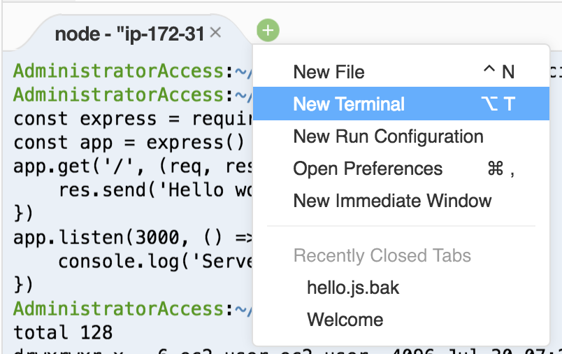
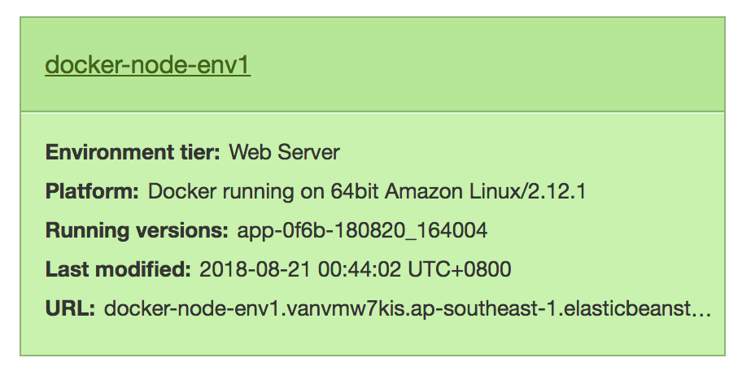
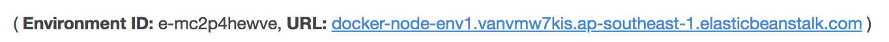

## Lab 3 : Create & Deploy Your First Docker Image

- Use a Lab-01 source and images to complete this lab.

### 1. Containerising our Node Application

#### 1.1. Create a Dockerfile

1.  Create a **Dockerfile**, and edit it in the IDE

```
$ touch ~/environment/beanstalk-workshop/Dockerfile
```

Add the following configuration to the Dockerfile

```
FROM node:6

# Create app directory
WORKDIR /usr/src/app

# Install app dependencies
COPY package*.json ./

RUN npm install

# Bundle app source
COPY . .

EXPOSE 8080

CMD [ "npm", "start" ]
```

**Note**: You can specify multiple container ports, but Elastic Beanstalk uses only the first one to connect your container to the host's reverse proxy and route requests from the public Internet.

Reference: https://docs.aws.amazon.com/elasticbeanstalk/latest/dg/create_deploy_docker_image.html

2.  Create a **.dockerignore** file, and edit it in the IDE

```
$ touch ~/environment/beanstalk-workshop/.dockerignore
```

Add the following configuration:

```
node_modules
npm-debug.log
```

The docker ignore file specifies files & folders to ignore when executing the **COPY** command in the Dockerfile above

#### 1.2 Edit Application to use Port 8080

1.  Edit **index.js** file

from

```
const express = require("express");
const app = express();

app.get("/", (req, res) => {
  res.send("Full capacity during deployments!. Server is up on: " + process.env.PORT);
});
app.listen(process.env.PORT, () => {
  console.log("Server is up on: " + process.env.PORT);
});
```

to

```
const express = require("express");
const app = express();
const appPort = 8080;

app.get("/", (req, res) => {
  res.send("Docker node is up on: " + appPort);
});
app.listen(appPort, () => {
  console.log("Server is up on: " + appPort);
});
```

#### 1.3 Build and Run the Container Locally

1.  Use the **docker build** command to build our image based on our **Dockerfile** above

```
$ docker build -t workshop/node:1.0 .
```

2.  Use the **docker run** command to run the built image as a container

```
$ docker run -p 8080:8080 workshop/node:1.0

> beanstalk-workshop@1.0.0 start /usr/src/app
> node index.js

Server is up on: 8080
```

3.  Open a new terminal



4.  Run the curl command to test API

```
$ curl localhost:8080

Docker node is up on: 8080
```

### 2. Deploy Containerised Application on Elastic Beanstalk

#### 2.1 Reinitialise Elastic Beanstalk Application to use Docker platform

1.  Remove local Elastic Beanstalk configuration

```
$ rm -rf .elasticbeanstalk
```

2.  Reinitialise Elastic Beanstalk

```
$ eb init
```

3.  Enter **7** to select Singapore region

```
Select a default region
1) us-east-1 : US East (N. Virginia)
2) us-west-1 : US West (N. California)
3) us-west-2 : US West (Oregon)
4) eu-west-1 : EU (Ireland)
5) eu-central-1 : EU (Frankfurt)
6) ap-south-1 : Asia Pacific (Mumbai)
7) ap-southeast-1 : Asia Pacific (Singapore)
8) ap-southeast-2 : Asia Pacific (Sydney)
9) ap-northeast-1 : Asia Pacific (Tokyo)
10) ap-northeast-2 : Asia Pacific (Seoul)
11) sa-east-1 : South America (Sao Paulo)
12) cn-north-1 : China (Beijing)
13) cn-northwest-1 : China (Ningxia)
14) us-east-2 : US East (Ohio)
15) ca-central-1 : Canada (Central)
16) eu-west-2 : EU (London)
17) eu-west-3 : EU (Paris)
(default is 3): 7
```

4.  Enter **2** Create a new application called **beanstalk-workshop-node**

```
Select an application to use
1) beanstalk-workshop
2) [ Create new Application ]

Enter Application Name
(default is "beanstalk-workshop2"): beanstalk-workshop-node
```

5.  Enter **Y** to select Docker platform

```
It appears you are using Docker. Is this correct?
(Y/n): Y
```

Enter **1** to select docker version **18.03.1-ce**

```
Select a platform version.
1) Docker 18.03.1-ce
2) Docker 17.12.1-ce
3) Docker 17.09.1-ce
4) Docker 17.06.2-ce
5) Docker 17.03.2-ce
6) Docker 1.12.6
7) Docker 1.11.2
8) Docker 1.9.1
9) Docker 1.7.1
10) Docker 1.6.2
(default is 1): 1
```

6.  Enter **y** to continue with CodeCommit with Elastic Beanstalk

```
Note: Elastic Beanstalk now supports AWS CodeCommit; a fully-managed source control service. To learn more, see Docs: https://aws.amazon.com/codecommit/
Do you wish to continue with CodeCommit? (y/N) (default is n): y
```

7.  Enter **1** to select existing **beanstalk-workshop** CodeCommit repository

```
Select a repository
1) beanstalk-workshop
2) [ Create new Repository ]
(default is 2): 2
```

Enter **1** to select existing **master** branch

```
Select a branch
1) master
2) [ Create new Branch with local HEAD ]
(default is 1): 1
```

8.  Enter **n** when prompted to setup SSH access

```
Cannot setup CodeCommit because there is no Source Control setup, continuing with initialization
Do you want to set up SSH for your instances?
(Y/n): n
```

#### 2.2 Deploy Containerised Application

1.  Run eb create command to create an EB environment. This creates an environment and deploys your application

```
$ git add .
$ git commit -m "Docker Node"
$ git push

$ eb create docker-node-env1 --elb-type application

#Example
$ eb create sample-node-env1 --vpc.id vpc-0f671cf4cdf8efe8d --vpc.elbsubnets subnet-0ab86bd1f10dd760d,subnet-0ad50e2284d4d2e58 --vpc.elbpublic --vpc.ec2subnets subnet-0ab86bd1f10dd760d,subnet-0ad50e2284d4d2e58 --elb-type application
```

#### 2.3 View deployed application

1.  Navigate to the EB service, and select your newly created environment **docker-node-env1**



2.  Access your application via the URL shown



You'll be greeted with the Docker node message


